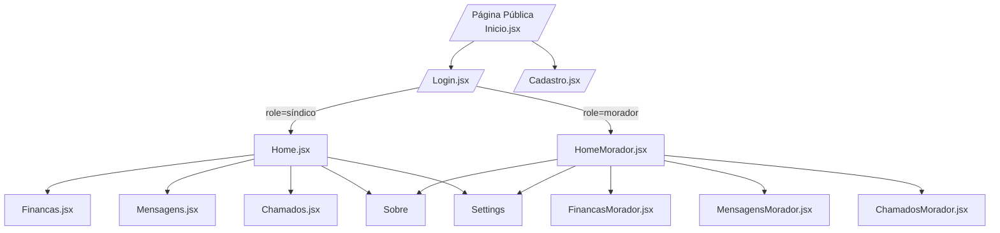
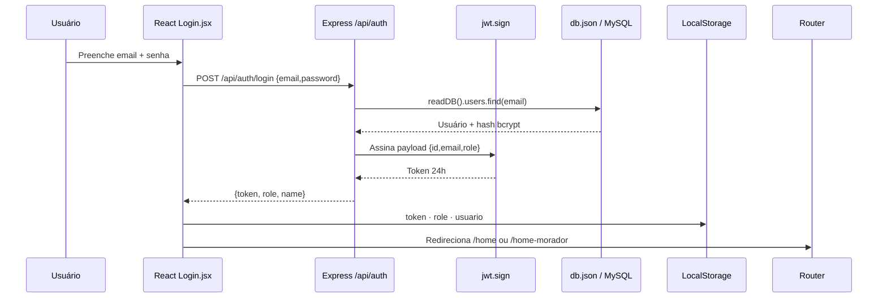
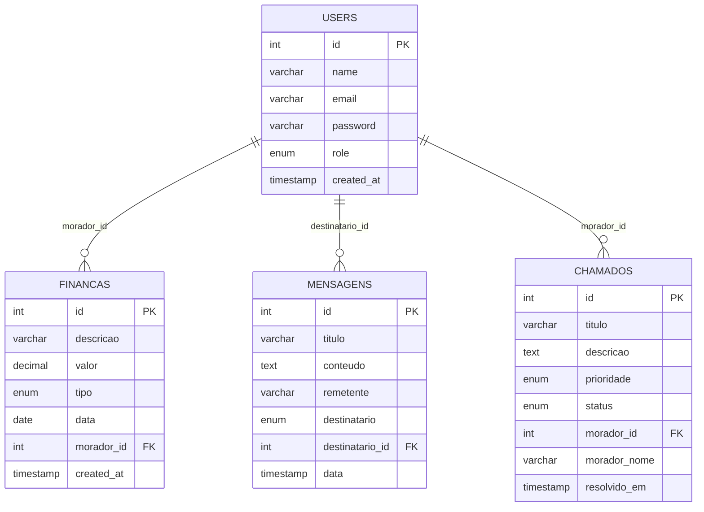

# DOMUS — A Plataforma Definitiva de Gestão Condominial

> “Condomínios não são apenas prédios: são ecossistemas sociais. O DOMUS existe para conectar pessoas, processos e decisões em um único pulso digital.” — Equipe DOMUS

---

## 1. Introdução Épica do DOMUS

O DOMUS nasceu como um projeto de TCC, mas foi arquitetado como um produto profissional. Imagine um condomínio que respira dados em tempo real: o síndico acompanha finanças, chamados e comunicados na mesma tela; moradores recebem respostas instantâneas, registram incidentes em segundos e sentem que a gestão é transparente.  

Essa plataforma entrega:
- **Propósito**: transformar tarefas burocráticas em experiências simples, belas e seguras.
- **Visão**: ser o copiloto digital de condomínios inteligentes, habilitando decisões baseadas em dados e colaboração.
- **Problema resolvido**: comunicação fragmentada, planilhas imprecisas e ausência de rastreabilidade nas rotinas condominiais.
- **Impacto**: mais confiança entre síndicos e moradores, redução drástica de conflitos e ganho de produtividade administrativa.

DOMUS combina storytelling visual (vídeos hero em `Inicio.jsx`, dashboards animados em `Home.jsx`) com engenharia sólida em `backend/src`, entregando um case que prende avaliadores desde o pitch até a demo final.

---

## 2. Painel de Tecnologias

| Tecnologia | Versão | Por que usamos | Função exata no DOMUS |
| --- | --- | --- | --- |
| React | 18.2.0 | UI declarativa, componentização e comunidade madura | Páginas em `frontend/src/components`, roteamento em `routes/AppRouter.jsx` |
| React Router DOM | 6.20.0 | Navegação sem page reload | Mapeia telas públicas e privadas (`/home`, `/financas-morador`, etc.) |
| Axios | 1.6.2 | Cliente HTTP moderno com interceptors | `services/api.js` injeta JWT em cada chamada `/api/*` |
| SASS / SCSS | 1.69.5 | Escala de estilos com variáveis e nesting | Identidade visual centralizada em `styles/global.scss` |
| React Icons | 4.12.0 | Biblioteca leve de ícones | Ícones funcionais em `Sidebar.jsx`, `Header.jsx`, `Login.jsx` |
| React Scripts (CRA) | 5.0.1 | DX optimizada sem configs extras | Boot da aplicação para o modo CRA (`frontend`) |
| Webpack + Babel | Custom (`webpack.config.js`) | Bundle alternativo para o laboratório `/src` na raiz | Permite rodar o mesmo front via `npm run dev` na raiz |
| Express | 4.18.2 | API REST veloz e minimalista | `backend/src/server.js` orquestra rotas `/api/*` |
| CORS | 2.8.5 | Segurança cross-origin | Middleware global no servidor |
| dotenv | 16.3.1 | Segredos parametrizados | Porta e `JWT_SECRET` via `.env` |
| bcryptjs | 2.4.3 | Hash de senha confiável | Uso direto em `AuthController.js` |
| jsonwebtoken | 9.0.2 | Autenticação stateless | `middlewares/auth.js` valida tokens |
| mysql2 | 3.6.5 | Ponte pronta para banco real | `config/database.js` e `schema.sql` dão upgrade instantâneo |
| nodemon | 3.0.1 | Hot reload no back-end | Script `npm run dev` no `backend` |
| http-proxy-middleware | 2.0.6 | Proxy transparente no dev | `frontend/src/setupProxy.js` elimina CORS em desenvolvimento |

> 💡 **Insight**: mesmo com banco JSON (`backend/data/db.json`) para simplicidade do TCC, o código já traz camada pronta para MySQL, garantindo narrativa de escalabilidade.

---

## 3. Arquitetura Completa (com diagramas Mermaid)

### 3.1 Comunicação Front ↔ Back

```mermaid
graph LR
  A[React 18 UI<br/>Frontend (CRA ou Webpack Root)] -- Axios + JWT --> B[Express API<br/>/api/auth · /api/financas · ...]
  B -- read/write --> C[(Persistência:<br/>db.json por padrão<br/>MySQL via pool opcional)]
  A <-- Proxy 3000↔5000 --> B
```

### 3.2 Principais Rotas de Navegação



### 3.3 Fluxo de Autenticação



### 3.4 Fluxo de Dados End-to-End

```mermaid
graph LR
  subgraph Morador/Síndico
    UI[Componentes React]
    Hook[Hooks (useState/useEffect/useNavigate/useLocation)]
  end
  subgraph Serviços
    APIClient[services/api.js<br/>Axios + interceptors]
  end
  subgraph Backend
    Routes[Routes \\auth \\financas \\mensagens \\chamados]
    Controllers[Controllers<br/>Auth/Finanças/Mensagens/Chamados]
    Middlewares[JWT Middleware<br/>authenticateToken · requireSindico/Morador]
    Persistence[(readDB · writeDB<br/>ou query MySQL)]
  end
  UI --> Hook --> APIClient --> Routes --> Controllers --> Middlewares --> Persistence
  Persistence --> Controllers --> Routes --> APIClient --> UI
```

### 3.5 Diagrama do Banco de Dados



---

## 4. Estrutura de Pastas Comentada

```
TCC-Domus-master/
├── backend/
│   ├── data/db.json
│   ├── schema.sql
│   └── src/
│       ├── config/{db.js,database.js}
│       ├── controllers/{Auth,Financas,Mensagens,Chamados}Controller.js
│       ├── middlewares/auth.js
│       ├── routes/{auth,financas,mensagens,chamados}Routes.js
│       └── server.js
├── frontend/
│   ├── public/{index.html,assets/...}
│   └── src/
│       ├── assets/logo.svg
│       ├── components/*.jsx + *.scss
│       ├── routes/AppRouter.jsx
│       ├── services/{api.js,authRoutes.js}
│       ├── styles/global.scss
│       └── setupProxy.js
├── src/ (laboratório Webpack standalone)
│   ├── components/... (espelho do frontend)
│   ├── controllers/AuthController.js (para testes)
│   └── server.js / routes / utils
├── public/assets/ (videos e ícones institucionais)
├── utilitarios/
│   ├── DOCUMENTACAO_FRONTEND_DOMUS.md
│   ├── DOCUMENTACAO_BACKEND_DOMUS.md
│   ├── INSTRUCOES_RAPIDAS.md
│   ├── ESTRUTURA_PROJETO.md
│   └── README.md (resumo executivo)
├── webpack.config.js (build alternativo)
└── package.json (scripts orquestradores)
```

- `backend/` — API Express com camada de persistência via arquivo JSON (`config/db.js`) e pool MySQL opcional (`config/database.js`). `schema.sql` oferece migrations completas.
- `frontend/` — SPA React (CRA) com componentes organizados por domínio e estilos co-localizados (`Component.jsx` + `Component.scss`).
- `src/` (raiz) — clone deliberado do front/back para executar via Webpack puro, usado em demonstrações offline; compartilha os mesmos componentes e rotas.
- `public/` (raiz) — assets institucionais usados em apresentações, incluindo o vídeo `DOMUS_1.mp4` exibido na landing de `Inicio.jsx`.
- `utilitarios/` — dossiê completo: guias rápidos, documentação técnica e estrutura textual para avaliadores.
- `webpack.config.js` — configura bundler alternativo com Babel, loaders SCSS/asset e proxy `/api`.

> 📎 **Nota**: Nunca delete `backend/data/db.json` — ele é inicializado automaticamente, mas guarda o storytelling da demo (usuários reais, chamados e mensagens usadas em pitch).

---

## 5. Explicação dos Fluxos Internos

### 5.1 Login
1. `Login.jsx` valida campos com feedback instantâneo (alertas humanizados).
2. Ao submeter, chama `authService.login` (`services/api.js`) que envia POST `/api/auth/login`.
3. O token e o perfil retornam e são persistidos em `localStorage`.
4. `useNavigate` redireciona dinamicamente (`/home` para síndico, `/home-morador` para moradores).
5. `Header.jsx` e `Sidebar.jsx` leem `localStorage` para personalizar nome e menu.

### 5.2 JWT
1. `api.interceptors.request` injeta `Authorization: Bearer <token>`.
2. `authenticateToken` em `middlewares/auth.js` usa `jwt.verify` com `process.env.JWT_SECRET || 'secret'`.
3. Em caso de expiração (403) o interceptor remove credenciais e força `/login`.
4. `requireSindico` e `requireMorador` garantem separação de poderes de rota a rota.

### 5.3 Simulação de Pagamento
1. Síndico acessa `Financas.jsx`.
2. `financasService.getMoradores()` popula o select com moradores reais da base (`FinancasController.getMoradores`).
3. Ao aplicar taxa/multa/pagamento, POST `/api/financas/aplicar-valor` cria transação com tipagem `pago` ou `devido` (vide `FinancasController.aplicarValor`).
4. `db.financas` é atualizado, o dashboard recalcula receitas/despesas/saldo e o morador passa a ver o novo lançamento em `FinancasMorador.jsx`.

### 5.4 Dashboard
1. `Home.jsx` e `HomeMorador.jsx` autenticam na montagem (verificação de token) e carregam `usuario`.
2. Os cards interativos (SCSS com hover + sombras) usam heurísticas de chunking (máx. 3 cards por linha) para reduzir overload cognitivo.
3. `Sidebar` destaca rota ativa via `useLocation`.

### 5.5 Consulta ao Banco
1. `config/db.js` inicializa `data/db.json` com estrutura `{users, financas, mensagens, chamados}`.
2. Controllers chamam `readDB()` para obter snapshot e `writeDB()` para persistir.
3. Ordenações e filtros são feitos in-memory (e.g. `FinancasController.getAll` ordena por `data desc`).
4. Para MySQL, `config/database.js` e `schema.sql` assumem as queries; basta trocar chamadas por `query(sql, params)`.

### 5.6 Upload de Imagem
> ⚠️ **Status atual**: não há upload direto de imagem. O projeto oferece assets estáticos (`frontend/public/assets` e `public/assets`) e placeholders (ícones, logos, vídeos). O roadmap (sec. 11) já contempla um pipeline de upload (S3/local) alinhado aos endpoints REST existentes.

### 5.7 Hooks e Contextos
- Hooks utilizados: `useState`, `useEffect`, `useNavigate`, `useLocation`.
- Não há Context API por escolha arquitetural: cada página é independente e lê dados do `localStorage` + serviços.
- `Header` usa `useEffect` global para fechar dropdown ao clicar fora.
- `Sidebar` usa `useLocation` para “stickiness” visual.

### 5.8 Regras de UI
- Cores e tipografia centralizadas em `styles/global.scss`.
- Componentes críticos (Finanças, Chamados, Mensagens) utilizam SCSS compartilhado (cards com gradientes, badges de status e animações `transform`).
- Layouts fixos (`Sidebar` + `Header`) mantêm constância visual e economia de cliques.
- Responsividade garantida com media queries (`@media (max-width: 1024px)` em Mensagens/Chamados).

---

## 6. Documentação Técnica do Backend

### 6.1 Stack e Middleware
- **Servidor**: `backend/src/server.js` (Express, JSON parser, CORS, rotas montadas em `/api/*`).
- **Persistência padrão**: `config/db.js` (`readDB`, `writeDB`, fail-safe`).
- **Persistência opcional**: `config/database.js` (pool MySQL, `query()` pronto para uso).
- **Autenticação**: `middlewares/auth.js` (JWT + role-based guard).

### 6.2 Rotas & Endpoints

| Domínio | Método | Endpoint | Descrição | Body Principal | Resposta Sucesso | Erros |
| --- | --- | --- | --- | --- | --- | --- |
| Auth | POST | `/api/auth/register` | Novo usuário | `{ name,email,password,role }` | `201 + user sanitizado` | 400 (campos), 400 (email), 500 |
| Auth | POST | `/api/auth/login` | Login JWT | `{ email,password }` | `200 + {token,role,name,email}` | 400 (campos), 401 (credenciais), 500 |
| Finanças (síndico) | GET | `/api/financas` | Totais e transações | — | `{ receitas,despesas,saldo,transacoes[] }` | 403 (role), 500 |
| Finanças (morador) | GET | `/api/financas/morador` | Extrato pessoal | — | `{ totalDevido,totalPago,saldo,transacoes[] }` | 401/403, 500 |
| Finanças (síndico) | GET | `/api/financas/moradores` | Lista moradores | — | `[ {id,nome,email} ]` | 403, 500 |
| Finanças (síndico) | POST | `/api/financas/aplicar-valor` | Aplica taxa/multa/pagamento | `{moradorId,valor,tipo}` | `201 + transacao` | 400 (campos), 404 (morador), 500 |
| Finanças (síndico) | POST | `/api/financas` | Cria transação manual | `{descricao,valor,tipo,data?}` | `201 + transacao` | 400, 500 |
| Finanças (síndico) | PUT | `/api/financas/:id` | Atualiza transação | Partial body | `200 + transacao` | 404, 500 |
| Finanças (síndico) | DELETE | `/api/financas/:id` | Remove transação | — | `200 + message` | 404, 500 |
| Mensagens (síndico) | GET | `/api/mensagens` | Inbox completa | — | `[mensagens]` | 403, 500 |
| Mensagens (morador) | GET | `/api/mensagens/morador` | Inbox pessoal | — | `[mensagens filtradas]` | 500 |
| Mensagens (síndico) | POST | `/api/mensagens` | Broadcast/unicast | `{destinatario,assunto,mensagem}` | `201 + mensagem` | 400, 500 |
| Mensagens (síndico) | DELETE | `/api/mensagens/:id` | Remove | — | `200 + message` | 404, 500 |
| Chamados (síndico) | GET | `/api/chamados` | Todos os chamados | — | `[chamados]` | 403, 500 |
| Chamados (morador) | GET | `/api/chamados/morador` | Meus chamados | — | `[chamados filtrados]` | 500 |
| Chamados (autenticado) | POST | `/api/chamados` | Cria chamado | `{titulo,descricao,prioridade?}` | `201 + chamado` | 400, 500 |
| Chamados (síndico) | PUT | `/api/chamados/:id/resolve` | Atualiza status | — | `200 + chamado resolvido` | 404, 500 |
| Chamados (síndico) | DELETE | `/api/chamados/:id` | Remove | — | `200 + message` | 404, 500 |

> 📘 **Mensagem de erro padrão**: `{ "message": "Descrição" }` com status coerentes (400, 401, 403, 404, 500).

### 6.3 Middleware JWT

```16:74:backend/src/middlewares/auth.js
const authenticateToken = (req, res, next) => {
  const authHeader = req.headers['authorization'];
  const token = authHeader && authHeader.split(' ')[1];
  if (!token) return res.status(401).json({ message: 'Token de autenticação não fornecido' });
  jwt.verify(token, process.env.JWT_SECRET || 'secret', (err, user) => {
    if (err) return res.status(403).json({ message: 'Token inválido ou expirado' });
    req.user = user;
    next();
  });
};
```

- Use `requireSindico` / `requireMorador` após `authenticateToken` para proteger rotas sensíveis.

### 6.4 Conectar ao MySQL
1. Configure `.env` no `backend` com credenciais reais (`DB_HOST`, `DB_USER`, etc.) e ajuste `config/database.js`.
2. Execute `mysql -u root -p < backend/schema.sql` para criar banco, tabelas e seeds.
3. Adapte controllers substituindo leituras `readDB()` por `await query('SELECT ...')`.
4. `testConnection()` em `config/database.js` garante diagnóstico no boot.

### 6.5 Queries e Ordenações Existentes
- `FinancasController.getAll` ordena por data decrescente e calcula receitas/despesas.
- `FinancasController.getMorador` filtra `moradorId` e classifica por `tipo` (`devido` vs `pago`).
- `ChamadosController.getAll` e `MensagensController.getAll` ordenam por timestamp.
- Todas as atualizações são idempotentes: `update` e `resolve` localizam pelo `id` numérico e persistem com `writeDB`.

### 6.6 Migrations
```bash
# Dentro de backend/
mysql -u root -p < schema.sql
```
`schema.sql` cria todas as tabelas, seed inicial e relações (FKs). Ideal para demonstrar prontidão para produção diante da banca.

---

## 7. Documentação Técnica do Frontend

### 7.1 Páginas & Fluxos

| Página | Componentes-chave | Hooks | Serviços/API | Estilos |
| --- | --- | --- | --- | --- |
| Landing (`Inicio.jsx`) | Vídeo `DOMUS_1.mp4`, CTA dual | — | — | `Inicio.scss` |
| Login | `FaUser`, `FaLock`, password toggle | `useState`, `useNavigate` | `authService.login` | `Login.scss` |
| Cadastro | Formulário multi-step | `useState`, `useNavigate` | `authService.register` | `Cadastro.scss` |
| Home (síndico) | `Sidebar`, `Header`, cards | `useEffect` | — | `Home.scss` |
| Home (morador) | Dashboard personalizado | `useEffect` | — | `Home.scss` |
| Finanças (síndico) | Cards, tabela, form aplicar valor | `useEffect`, `useState` | `financasService.*` | `Financas.scss` |
| Finanças Morador | Cards Pessoais, tabela | `useEffect`, `useState` | `financasService.getMorador` | `Financas.scss` |
| Mensagens (síndico) | Form + inbox | `useEffect` | `mensagensService` | `Mensagens.scss` |
| Mensagens Morador | Inbox + contato com síndico | `useEffect` | `mensagensService` | `Mensagens.scss` |
| Chamados (síndico) | Form + lista, resolver | `useEffect` | `chamadosService` | `Chamados.scss` |
| Chamados Morador | Form + meus chamados | `useEffect` | `chamadosService` | `Chamados.scss` |
| Sobre | Cards institucionais | `useEffect` | — | `Sobre.scss` |
| Settings | Form preferências | `useEffect`, `useState` | — (localStorage) | `Settings.scss` |

### 7.2 Componentes Compartilhados
- `Sidebar.jsx`: recebe `userRole` e renderiza menus com ícones (`FaHome`, `FaDollarSign`...). Ativa links com `useLocation`.
- `Header.jsx`: controla dropdown com `useState`, `useEffect` (event listener global). Ações: Configurações, Trocar Conta, Logout (limpa `localStorage` e navega para `/`).

### 7.3 Hooks de Serviço
- `services/api.js` instancia Axios com `baseURL: '/api'` e interceptors (token + tratamento 401).
- Serviços exportados: `authService`, `financasService`, `mensagensService`, `chamadosService`.

### 7.4 SCSS e Design System
- `styles/global.scss` define cores, reset e padrões tipográficos.
- Cada componente possui SCSS co-localizado para manter escopo.
- Gradientes estratégicos (`Financas.scss`) reforçam recompensas visuais (receita vs despesa).

### 7.5 Build e Proxy
- CRA: `npm start` com proxy configurado via `src/setupProxy.js`.
- Webpack standalone: `npm run dev` na raiz (usa `webpack.config.js` com loaders SCSS/asset).

---

## 8. Guia de Instalação Universal

1. **Pré-requisitos**
   - Node.js 18+ e npm
   - MySQL (opcional para cenário avançado)
2. **Clonar ou obter o projeto**
   ```bash
   git clone <repo> TCC-Domus
   cd TCC-Domus
   ```
3. **Instalar tudo em um comando**
   ```bash
   npm run install:all
   ```
4. **Configurar `.env` do backend (`backend/.env`)**
   ```env
   PORT=5000
   JWT_SECRET=domus_secret_key_2024_tcc
   ```
   > ☑️ Se usar MySQL, inclua `DB_HOST`, `DB_USER`, `DB_PASSWORD`, `DB_NAME=domus_db`.
5. **(Opcional) Provisionar banco MySQL**
   ```bash
   cd backend
   mysql -u root -p < schema.sql
   cd ..
   ```
6. **Subir backend**
   ```bash
   cd backend
   npm run dev   # usa nodemon, porta 5000
   ```
7. **Subir frontend**
   ```bash
   cd frontend
   npm start     # abre http://localhost:3000
   ```
8. **Testar comunicação**
   - Endpoint saúde: `GET http://localhost:5000/api/health`
   - Fluxo completo: registrar no `/cadastro`, logar, abrir dashboards.
9. **Executar build de produção**
   ```bash
   cd frontend && npm run build
   cd ../backend && npm start
   ```
10. **Rodar via Webpack standalone (opcional)**
    ```bash
    npm run dev   # utiliza /src e webpack.config.js
    ```

<details>
<summary>📦 Scripts auxiliares</summary>

| Local | Script | Ação |
| --- | --- | --- |
| raiz | `npm run dev` | Sobe webpack front + proxy |
| raiz | `npm run build` | Build Webpack |
| frontend | `npm start` / `npm run build` | CRA padrão |
| backend | `npm run dev` / `npm start` | API com/sem nodemon |

</details>

---

## 9. Como o DOMUS utiliza Princípios de UX/UI

- **Simplicidade cognitiva**: formulários com inputs lineares e labels claros (Login, Cadastro) evitam sobrecarga.
- **Agrupamento (chunking)**: cards de dashboards e seções (Mensagens, Chamados) limitam-se a blocos de até 3 elementos.
- **Consistência visual**: grid fixo (`Sidebar + Header + Content`), ícones uniformes e tipografia Verdana em todos os SCSS.
- **Hierarquia clara**: títulos `h2` centralizados, subtítulos informativos e CTAs com cores fortes.
- **Neutralidade emocional**: paleta azul/branco transmite confiança institucional, reduzindo ruído.
- **Contraste significativo**: badges de status (verde receita, vermelho despesa) auxiliam leitura rápida.
- **Economia de cliques**: menus diretos, sem subníveis; links estratégicos dentro dos cards.
- **Acessibilidade básica**: campos com labels, botões com `:hover`, ícones com `aria` semântica herdada dos `react-icons`.

---

## 10. Princípios de Neurociência e Gatilhos Mentais Aplicados

- **Repetição espaçada**: dashboards reforçam diariamente os mesmos padrões (cards e badges), solidificando memória operacional.
- **Recompensa visual**: gradientes e animações sutis em cards fornecem feedback instantâneo quando dados positivos aparecem.
- **Feedback imediato**: alertas e loaders (`Entrando...`, `Aplicando...`) informam o cérebro em milissegundos sobre o progresso.
- **Clareza**: microtextos explicativos em cada página (“Gerencie seu condomínio...”) reduzem ambiguidade.
- **Fluidez**: roteamento SPA elimina tempos mortos, mantendo o usuário em estado de fluxo.
- **Autonomia do usuário**: moradores abrem chamados e enviam mensagens sem depender do síndico; síndicos aplicam valores com poucos cliques.

---

## 11. Roadmap Futuro REALISTA

| Feature | Descrição |
| --- | --- |
| 🆘 Sistema de tickets | Workflow com SLA, categorias e anexos |
| 💬 Chat interno | Canal síncrono síndico ↔ moradores (WebSocket) |
| 🧑‍💼 Área do síndico | KPIs avançados, relatórios exportáveis |
| 🛠️ Painel administrativo | Gestão de usuários, permissões e logs |
| ⚡ Integração Pix real | Pagamentos conciliados via API bancária |
| 🔔 Notificações push/email | Alertas automáticos para eventos críticos |
| 🔓 API pública | SDK para integrações com portaria, IoT e BI |
| 🌙 Modo escuro | Tema alternativo com persistência por usuário |

---

## 12. Créditos da Equipe

> “Quatro mentes, uma missão: humanizar a vida em condomínio.”

| Integrante | Função no projeto | Contribuições-chave |
| --- | --- | --- |
| João Victor G. | Product Owner & Full-stack | Planejamento funcional, dashboards, controllers base |
| Gabriel Ceni | Frontend Lead | Identidade visual, SCSS, experiência do usuário |
| Matheus (DevOps) | Backend & Infra | Estrutura Express, JWT, scripts de automação |
| Colaboradores convidados | QA & Conteúdo | Documentação em `utilitarios/`, dados de demonstração |

---

## 13. Conclusão Final Cinematográfica

Quando as luzes da banca se apagam e o DOMUS aparece na tela, fica claro: não é apenas um TCC — é um produto pronto para o mercado. Cada linha de código, cada gradient e cada diagrama contam a história de um condomínio que aprendeu a conversar com seus moradores.  

O próximo capítulo? Integrar sensores, pagamentos instantâneos e inteligência preditiva. DOMUS já tem a espinha dorsal. Agora, a comunidade acadêmica e o mercado só precisam apertar “deploy”.

> 🌟 **DOMUS — onde engenharia, design e neurociência se encontram para entregar confiança.**

---

